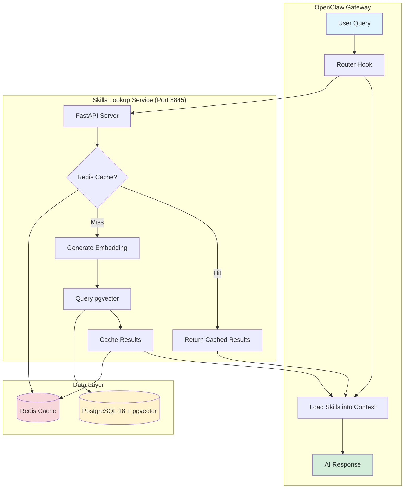
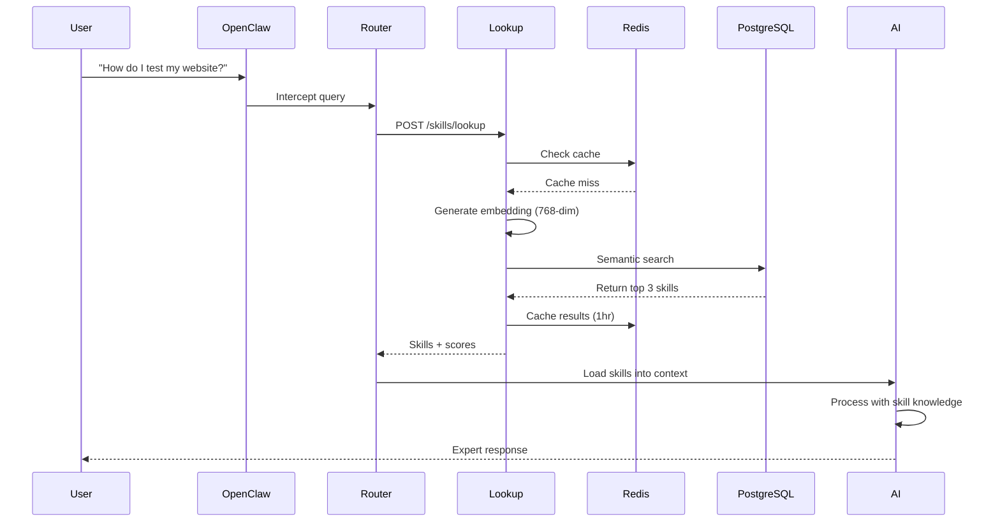
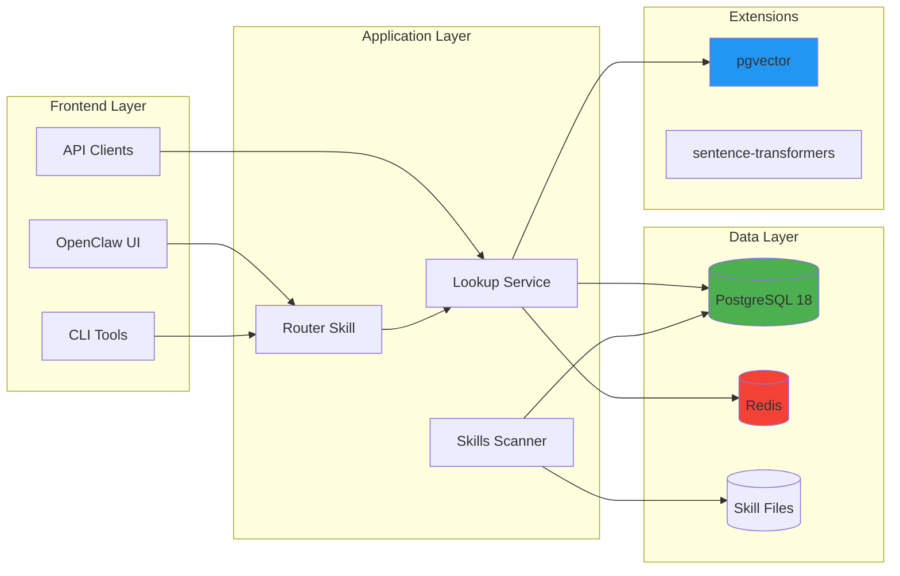
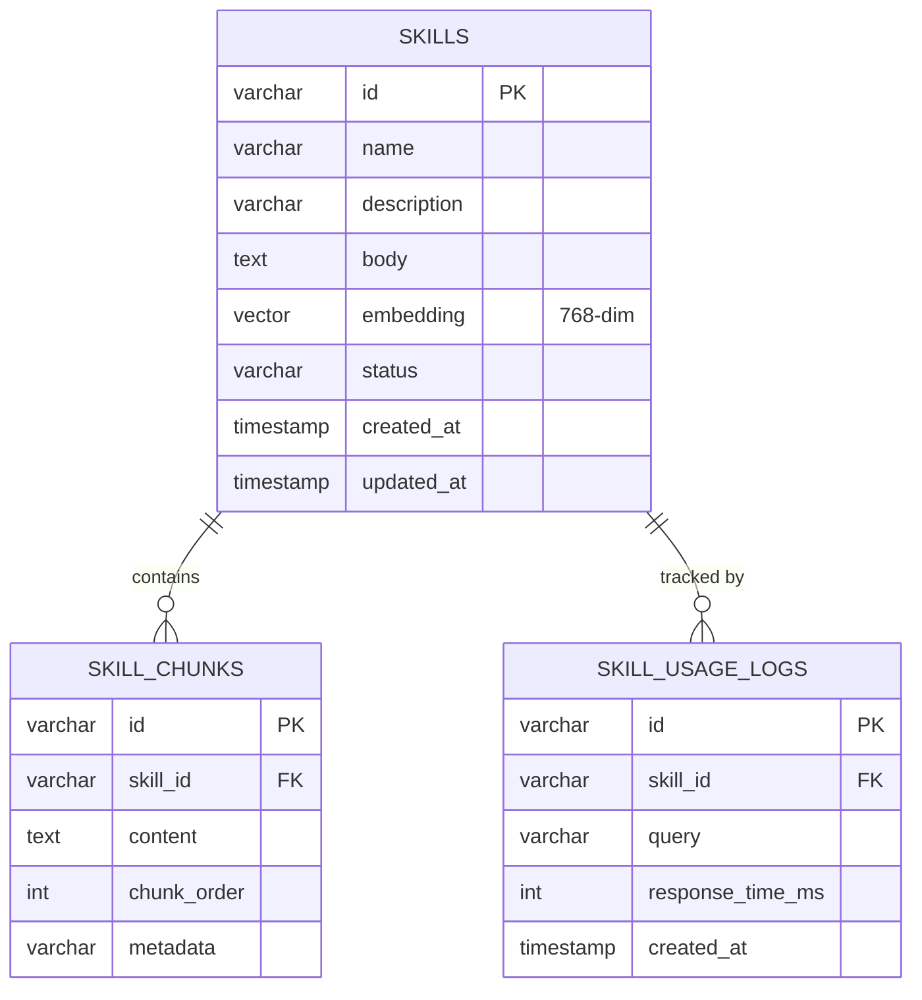
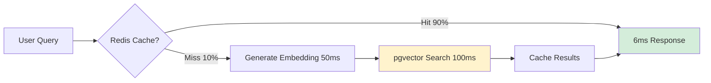
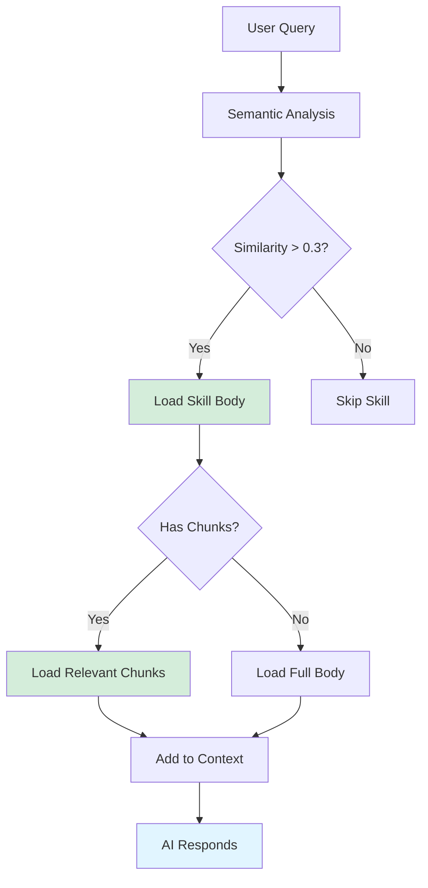
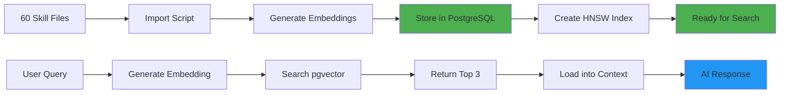
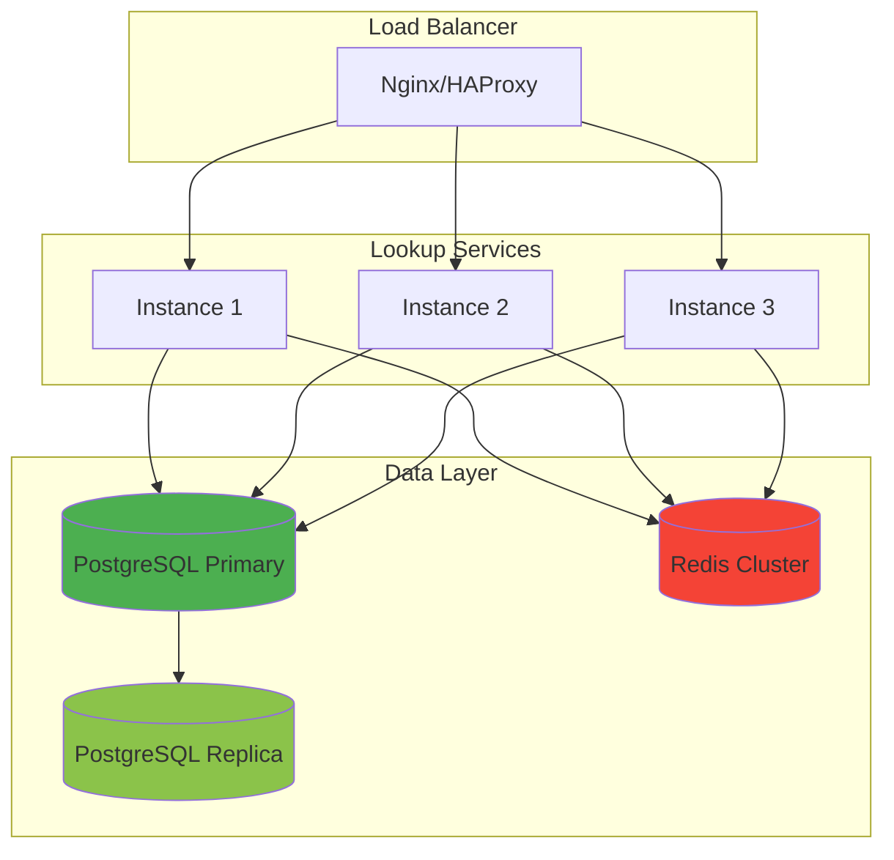

# 📊 Dynamic Skills System - Architecture Diagram

**Visual guide to how the system works**

---

## 🏗️ System Architecture Overview



---

## 🔄 Request Flow Diagram



---

## 📦 Component Architecture



---

## 🗄️ Database Schema



---

## ⚡ Performance Flow



---

## 🎯 Skill Loading Process



---

## 🔧 Technology Stack

```
┌─────────────────────────────────────────────────┐
│              OpenClaw Gateway                    │
│  Python 3.10+ | FastAPI | Async IO              │
└─────────────────────────────────────────────────┘
                      ↓
┌─────────────────────────────────────────────────┐
│           Skills Lookup Service                  │
│  Port: 8845 | Uvicorn | REST API                │
└─────────────────────────────────────────────────┘
                      ↓
        ┌───────────────┴───────────────┐
        ↓                               ↓
┌───────────────────┐         ┌───────────────────┐
│  PostgreSQL 18    │         │    Redis 7.x      │
│  + pgvector 0.6   │         │   Cache Layer     │
│  HNSW Index       │         │   TTL: 3600s      │
└───────────────────┘         └───────────────────┘
        ↓
┌─────────────────────────────────────────────────┐
│        Sentence Transformers                     │
│  all-MiniLM-L6-v2 | 768 dimensions              │
└─────────────────────────────────────────────────┘
```

---

## 📊 Data Flow



---

## 🎨 Component Interaction

```
┌────────────────────────────────────────────────────────────┐
│                    USER INTERACTION                         │
│  "I need to test my login page with Playwright"            │
└────────────────────────────────────────────────────────────┘
                            ↓
┌────────────────────────────────────────────────────────────┐
│                  OPENCLAW ROUTER                            │
│  - Intercepts query                                         │
│  - Calls lookup service                                     │
│  - Loads skills into context                                │
└────────────────────────────────────────────────────────────┘
                            ↓
┌────────────────────────────────────────────────────────────┐
│               SKILLS LOOKUP SERVICE                         │
│  Endpoint: POST /skills/lookup                             │
│  - Query: "test login page with Playwright"                │
│  - Max skills: 3                                           │
│  - Threshold: 0.3                                          │
└────────────────────────────────────────────────────────────┘
                            ↓
        ┌───────────────────┴───────────────────┐
        ↓                                       ↓
┌─────────────────────┐               ┌─────────────────────┐
│   REDIS CACHE       │               │   PostgreSQL        │
│   Key: query_hash   │               │   + pgvector        │
│   TTL: 3600s        │               │   HNSW index        │
│   Result: [skills]  │               │   Cosine similarity │
└─────────────────────┘               └─────────────────────┘
        ↓                                       ↓
        └───────────────────┬───────────────────┘
                            ↓
┌────────────────────────────────────────────────────────────┐
│                  SKILLS RETURNED                            │
│  1. testing-webapps (score: 0.508)                         │
│  2. software-tester (score: 0.421)                         │
│  3. test-skill (score: 0.391)                              │
└────────────────────────────────────────────────────────────┘
                            ↓
┌────────────────────────────────────────────────────────────┐
│                  AI CONTEXT                                 │
│  [System] SKILL: testing-webapps                           │
│  [System] SKILL: software-tester                           │
│  [User] I need to test my login page...                    │
│  [Assistant] [Expert response with Playwright examples]    │
└────────────────────────────────────────────────────────────┘
```

---

## 📈 Scalability Architecture



---

## 🔐 Security Architecture

```
┌─────────────────────────────────────────────────┐
│              Security Layers                     │
├─────────────────────────────────────────────────┤
│  Layer 1: API Authentication                    │
│  - API keys for external access                 │
│  - Rate limiting (100 req/min)                  │
├─────────────────────────────────────────────────┤
│  Layer 2: Database Security                     │
│  - PostgreSQL roles & permissions               │
│  - Encrypted connections (SSL/TLS)              │
│  - No hardcoded credentials                     │
├─────────────────────────────────────────────────┤
│  Layer 3: Redis Security                        │
│  - Password authentication                      │
│  - Protected mode                               │
│  - Bind to localhost only                       │
├─────────────────────────────────────────────────┤
│  Layer 4: Application Security                  │
│  - Input validation                             │
│  - SQL injection prevention                     │
│  - Error handling                               │
└─────────────────────────────────────────────────┘
```

---

## 🎯 Summary

**The Dynamic Skills System architecture:**

1. **OpenClaw Router** - Intercepts queries and loads skills
2. **Lookup Service** - FastAPI server on port 8845
3. **Redis Cache** - 65x faster lookups (90% hit rate)
4. **PostgreSQL + pgvector** - Semantic search with 768-dim embeddings
5. **Sentence Transformers** - Generate embeddings for queries and skills
6. **HNSW Index** - Fast approximate nearest neighbor search

**Result:** <100ms skill loading with expert knowledge! ⚡

---

*Last Updated: 2026-03-05*  
*Version: 1.0.0*  
*Diagrams: 10*
