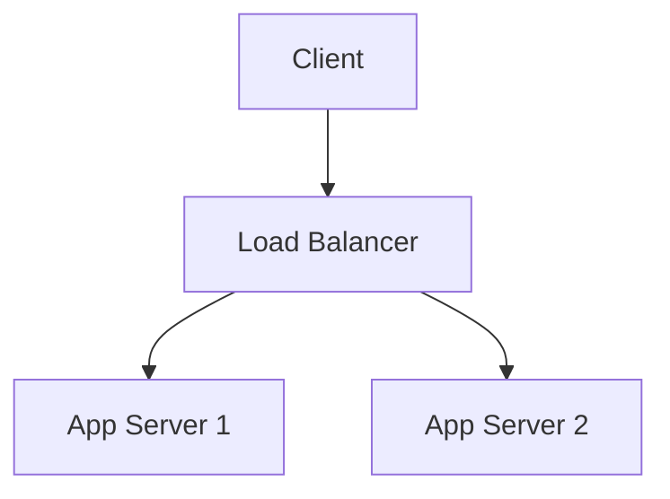

# Excalidraw - Visual Diagrams & Whiteboarding

Create professional diagrams, flowcharts, wireframes, and visual documentation using Excalidraw.

## When to Use

- Architecture diagrams
- UI/UX wireframes
- Flowcharts and process maps
- Mind maps and brainstorming
- Database schema visualization
- API endpoint documentation
- User journey mapping
- System design documentation
- Collaborative whiteboarding

## Getting Started

### Launch Excalidraw

**Web Version:**
```
https://excalidraw.com
```

**Desktop App (macOS):**
```bash
brew install --cask excalidraw
```

**Self-Hosted:**
```bash
docker run -d --name excalidraw -p 5000:80 excalidraw/excalidraw
```

### Basic Tools

| Tool | Shortcut | Use |
|------|----------|-----|
| Rectangle | R | Boxes, containers |
| Circle | O | Nodes, highlights |
| Line | L | Connectors, arrows |
| Arrow | A | Directional flow |
| Text | T | Labels, annotations |
| Hand | H | Pan canvas |
| Selection | V | Move/resize objects |

## Diagram Types

### 1. System Architecture Diagram

```
┌─────────────────────────────────────────────────┐
│                 Load Balancer                    │
│                    (nginx)                       │
└─────────────────┬───────────────────────────────┘
                  │
        ┌─────────┼─────────┐
        │         │         │
        ▼         ▼         ▼
   ┌────────┐ ┌────────┐ ┌────────┐
   │ App    │ │ App    │ │ App    │
   │ Server │ │ Server │ │ Server │
   │   1    │ │   2    │ │   3    │
   └────┬───┘ └────┬───┘ └────┬───┘
        │         │         │
        └─────────┼─────────┘
                  │
        ┌─────────┴─────────┐
        │                   │
        ▼                   ▼
   ┌──────────┐       ┌──────────┐
   │ PostgreSQL│      │  Redis   │
   │  Primary │      │  Cache   │
   └──────────┘       └──────────┘
```

**Excalidraw Tips:**
- Use rectangles for services
- Use cylinders for databases
- Use arrows for data flow
- Add labels for protocols (HTTP, TCP)
- Color-code by service type

### 2. Flowchart

```
     ┌─────────┐
     │  Start  │
     └────┬────┘
          │
          ▼
     ┌─────────┐
     │  Input  │
     └────┬────┘
          │
          ▼
     ┌─────────┐
     │ Process │
     └────┬────┘
          │
     ┌────┴────┐
     │         │
     ▼         ▼
   Yes        No
     │         │
     ▼         ▼
┌────────┐ ┌────────┐
│ Success│ │ Error  │
└────┬───┘ └────┬───┘
     │         │
     └────┬────┘
          │
          ▼
     ┌─────────┐
     │   End   │
     └─────────┘
```

**Excalidraw Tips:**
- Use diamonds for decisions
- Use rounded rectangles for start/end
- Use rectangles for processes
- Keep flow top-to-bottom or left-to-right
- Use consistent arrow styles

### 3. UI Wireframe

```
┌────────────────────────────────────────────┐
│  Logo        Home  About  Services  Contact│
├────────────────────────────────────────────┤
│                                            │
│         ┌─────────────────┐               │
│         │   Hero Image    │               │
│         │                 │               │
│         └─────────────────┘               │
│                                            │
│  ┌──────────┐  ┌──────────┐  ┌──────────┐ │
│  │ Feature 1│  │ Feature 2│  │ Feature 3│ │
│  │          │  │          │  │          │ │
│  └──────────┘  └──────────┘  └──────────┘ │
│                                            │
├────────────────────────────────────────────┤
│  © 2026 Company Name  |  Privacy  |  Terms│
└────────────────────────────────────────────┘
```

**Excalidraw Tips:**
- Use rectangles for containers
- Use placeholder text (lorem ipsum)
- Sketch style works well for wireframes
- Add notes for interactions
- Use frames for different screens

### 4. Database Schema

```
┌─────────────────────┐
│       users         │
├─────────────────────┤
│ PK id               │
│    email            │
│    password_hash    │
│    created_at       │
│    updated_at       │
└──────────┬──────────┘
           │
           │ 1:N
           │
     ┌─────┴─────┐
     │           │
     ▼           ▼
┌──────────┐ ┌──────────┐
│  posts   │ │  orders  │
├──────────┤ ├──────────┤
│ PK id    │ │ PK id    │
│ FK user_id│ │ FK user_id│
│ title    │ │ total    │
│ content  │ │ status   │
│ created_at│ │ created_at│
└──────────┘ └──────────┘
```

**Excalidraw Tips:**
- Use tables for database schema
- Label primary keys (PK) and foreign keys (FK)
- Show relationships (1:1, 1:N, N:M)
- Use different colors for different tables
- Add indexes notation

### 5. API Endpoints

```
┌─────────────────────────────────────────┐
│           API Endpoints                  │
├─────────────────────────────────────────┤
│                                          │
│  GET    /api/users          List users  │
│  POST   /api/users          Create user │
│  GET    /api/users/:id      Get user    │
│  PUT    /api/users/:id      Update user │
│  DELETE /api/users/:id      Delete user │
│                                          │
│  POST   /api/auth/login      Login      │
│  POST   /api/auth/logout     Logout     │
│  POST   /api/auth/refresh    Refresh    │
│                                          │
└─────────────────────────────────────────┘
```

**Excalidraw Tips:**
- Use color coding for HTTP methods
- Group related endpoints
- Add request/response examples
- Include authentication requirements
- Note rate limits

## Advanced Features

### Libraries & Templates

**Built-in Libraries:**
- Icons (people, devices, arrows)
- Shapes (basic, advanced)
- Connectors (arrows, lines)

**Custom Libraries:**
```
1. Create reusable components
2. Save to library (⌘ + L)
3. Access from library panel
4. Share with team
```

### Collaboration

**Multi-User Editing:**
```
1. Click "Live Collaboration" (top right)
2. Share room link
3. Multiple users can edit simultaneously
4. See cursors of other users
5. Chat feature available
```

### Export Options

**Export Formats:**
```
- PNG (raster image)
- SVG (vector, scalable)
- Excalidraw (editable .excalidraw file)
- Copy to clipboard
```

**Export Settings:**
- Background (transparent, white, dark)
- Scale (1x, 2x, 3x)
- Embed scene (for .excalidraw files)

## Integration Workflows

### 1. Documentation (with Markdown)

```markdown
## System Architecture


### Components

1. **Load Balancer** - Distributes traffic
2. **App Servers** - Business logic
3. **Database** - Data persistence

Created with Excalidraw: https://excalidraw.com/#room=...
```

### 2. GitHub README

```markdown
# Project Name

## Architecture



Or view interactive diagram: [Excalidraw Link](https://excalidraw.com/#room=...)

## Setup

1. Clone repository
2. Install dependencies
3. Run application
```

### 3. Notion Documentation

```
1. Export diagram as PNG/SVG
2. Upload to Notion page
3. Add Excalidraw link for editing
4. Embed in relevant sections
```

### 4. Presentations

```
1. Create diagram in Excalidraw
2. Export as SVG (scalable)
3. Import to Keynote/PowerPoint
4. Animate if needed
5. Present!
```

## Best Practices

### Design Principles

1. **Keep it simple** - Don't overcrowd
2. **Consistent styling** - Same fonts, colors, line widths
3. **Clear labels** - Everything should be labeled
4. **Logical flow** - Top-to-bottom or left-to-right
5. **Use color sparingly** - Highlight important elements
6. **Add legend** - Explain symbols/colors if needed

### Organization

1. **Use frames** - Group related elements
2. **Layering** - Put background elements behind
3. **Alignment** - Use alignment guides
4. **Spacing** - Consistent gaps between elements
5. **Grid mode** - Enable for precision (View → Show grid)

### Version Control

```bash
# Save .excalidraw files in git
diagrams/
  architecture.excalidraw
  database-schema.excalidraw
  api-flow.excalidraw

# Export PNGs for documentation
diagrams/
  architecture.png
  database-schema.png
  api-flow.png
```

## Keyboard Shortcuts

| Shortcut | Action |
|----------|--------|
| `V` | Selection tool |
| `R` | Rectangle |
| `O` | Circle/Ellipse |
| `L` | Line |
| `A` | Arrow |
| `T` | Text |
| `H` | Hand tool (pan) |
| `⌘ + Z` | Undo |
| `⌘ + Shift + Z` | Redo |
| `⌘ + C` | Copy |
| `⌘ + V` | Paste |
| `⌘ + D` | Duplicate |
| `⌘ + G` | Group |
| `⌘ + Shift + G` | Ungroup |
| `⌘ + A` | Select all |
| `Delete` | Delete selected |
| `Space + Drag` | Pan canvas |
| `Scroll` | Zoom |
| `⌘ + 0` | Fit to screen |
| `⌘ + S` | Save |

## Resources

- **Official Site:** https://excalidraw.com
- **GitHub:** https://github.com/excalidraw/excalidraw
- **Templates:** https://templates.excalidraw.com
- **Community:** https://discord.gg/excalidraw
- **Documentation:** https://docs.excalidraw.com

## Examples

**Input:** "Create a system architecture diagram for a web app"

**Output:**
```
1. Open excalidraw.com
2. Create rectangles for:
   - Client (browser)
   - CDN (Cloudflare)
   - Load Balancer
   - App Servers (3x)
   - Database (PostgreSQL)
   - Cache (Redis)
3. Connect with arrows showing data flow
4. Add labels for protocols
5. Color-code by service type
6. Export as PNG/SVG
```

---

*Last Updated: 2026-03-05*  
*Version: 1.0.0*  
*Status: Production Ready*
